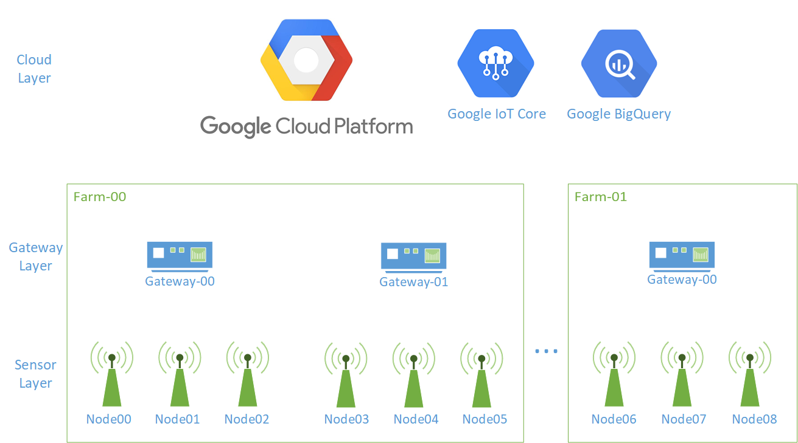

# Project-001 Technical Documentation

This solution was created as part of the BTech Project. The report for the same can be found [here](./documentation/BTP-Report.pdf).

The project requirements can be found [here](./documentation/req.md).

This repository contains all components that are a part of this solution. To download the full solution:

```sh
git clone --recurse-submodules https://github.com/Raghav-intrigue/dfpl-project001
```

Please refer to the detailed solution architecture given [here](./documentation/Architecture-Description.pdf) for proper understanding.

In brief, there are 3 main component layers: the nodes, the gateway, and cloud back-end:


* **The node:** ([link to the repository](https://github.com/Raghav-intrigue/dfpl-project001-node))
  
  A microcontroller with sensors that form a network and send data to the gateway.

  Each node has a unique NodeID that is used to configure it on the GCP console.

  Before a new node is added it needs to be flashed with a unique NodeID, that NodeID needs to be registered on GCP, and then bound to a gateway.

  After doing that it is a plug and play device, it can be managed over cloud.

* **The gateway:** ([link to the repository](https://github.com/Raghav-intrigue/dfpl-project001-gateway))
  
  Authenticates and relays the sensor data to cloud.
  
  Basically, a python script running on a raspberry pi that connects to the mesh via wifi and sends the telemetry data to Cloud.
  
  The cloud configuration: `{ "farmID" : "farm_001" , "datasetID": "rawSensorData"}` decides the dataset to which the gateway is adding data to and the farmID (which decides the name of the table in the database).

  After the initial setup, the gateway is also a plug and play device.

* **Cloud:**
  
  Google IoT Core and BigQuery are used for device management and archival storage respectively.

  Cloud setup only needs to be performed once in the project's lifetime.


# Full Deployment Process:

Solution deployment from scratch requires:

* **Initial cloud setup**
   
   This will be done only once in the projects lifetime.
   
   Follow the instructions in [Cloud setup from scratch](./documentation/cloud-from-scratch.md)

* **Device setup and registration**

    Each device (node and gateway) has a unique ID. This ID can be any arbitrary string (ensure consistency in the naming schema for convenience).

    The initial setup basically involves registering the device ID on cloud and setting it in the software.
    
    This will be done once for each device in it's lifetime.
    
    1. Open [Cloud Setup](./documentation/cloud.md) and follow the steps to setup a new farm:
   
       * Register Gateway (note down the gatewayID)
       * Register Nodes and Bind the nodes to the gateway (note the nodeIDs)

    2. Flash each node with the registered NodeIDs. See [Node Setup](https://github.com/Raghav-intrigue/dfpl-project001-node)

    3. Setup Gateway (software installation). See section [Gateway Setup](https://github.com/Raghav-intrigue/dfpl-project001-gateway)

* **Field Deployment**
  
  1. Turn on the gateway (Raspberry Pi)
     * Connect the given USB C power adapter  to the raspberry pi.
     * Connect the given 4G dongle to raspberry pi via usb
     * Turn on the raspberry pi
  2. Place the nodes in the field
  3. Turn them on
