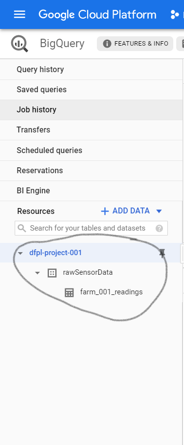

# Cloud Setup

[![Open in Cloud Shell][shell_img]][shell_link]

[shell_img]: https://gstatic.com/cloudssh/images/open-btn.png
[shell_link]: https://console.cloud.google.com/cloudshell/open?git_repo=https://github.com/Raghav-intrigue/dfpl-project001&page=editor&open_in_editor=documentation/new-farm-setup.md

Click the above button to open this repository in a Google Cloud Console.

The cloud setup on gcp has already been performed, if you want to perform the same from scratch, the instructions are available [here](./cloud-from-scratch.md).

Before following any of the steps below, ensure that these environment variables are set according to your cloud setup.

Run the following commands to set the environment variables (these are given with the current values, set them according to your cloud setup):

```sh
export PROJECT_ID="dfpl-project-001"
export PUBSUB_TOPIC="iotcore-topic"
export PUBSUB_SUBSCRIPTION="iotcore-subscription"
export REGISTRY_NAME="dfpl-temp"
export REGION_NAME="asia-east1"
export GATEWAY_NAME="test-gateway"
```

## Steps to setup a new farm:

1. The gateway needs to registered with a unique gatewayID on the Cloud. Follow the instructions [here](#register-gateway) to register the gatewayID.
   
2. Each node needs to be registered with a unique nodeID on the cloud. Follow the instructions [here](#register-node) to register each ID.
   
3. Each node registered above needs to be bound to the gateway registered above. Follow the instructions [here](#bind-node-to-gateway) to bind the nodes.
   
4. Set the farmID(unique farm identifier) and datasetID (according to your cloud setup) using the instructions [here](#to-change-the-farmid-and-datasetid-update-config).


## Register node

1. Open cloud shell, set the environment variables
2. Set the nodeID you want using `export MDEVICE_NAME="espmesh-00"`
3. Execute:
   
   ```sh
    gcloud iot devices create $MDEVICE_NAME \
        --region=$REGION_NAME \
        --registry=$REGISTRY_NAME \
        --device-type=non-gateway
   ```

## Bind node to gateway

1. Open cloud shell, set the environment variables
2. Set the nodeID you want using `export MDEVICE_NAME="espmesh-00"`
3. Set the GATEWAY_NAME you want to bind it to using `export GATEWAY_NAME="test-gateway"`
4. Execute:
   
   ```sh
    gcloud iot devices gateways bind \
        --device=espmesh-02 \
        --device-region=$REGION_NAME \
        --device-registry=$REGISTRY_NAME \
        --gateway=$GATEWAY_NAME \
        --gateway-region=$REGION_NAME \
        --gateway-registry=$REGISTRY_NAME \
        --project=$PROJECT_ID
   ```

## Register Gateway

1. Open cloud shell, set the environment variables
2. Set the GATEWAY_NAME using `export GATEWAY_NAME="test-gateway"`
3. Execute: 
   
   ```sh
    gcloud iot devices create $GATEWAY_NAME \
        --region=asia-east1 \
        --registry=dfpl-temp \
        --auth-method=association-only \
        --device-type=gateway \
        --project=$PROJECT_ID \
        --public-key path=rsa_cert.pem,type=rsa-x509-pem
   ```

## Other commands:

### To output the last 20 telemetry lines:

```sh
gcloud pubsub subscriptions pull \
--auto-ack $PUBSUB_SUBSCRIPTION \
--limit=20
```

### To access archival database

1. Open the url: `https://console.cloud.google.com/bigquery`
2. Select your project, the database name, and the table.
   
   

### To change the farmID and datasetID (update config)

1. Open cloud shell, set the environment variables

2. Set the FarmID using `export FARM_ID="farm_001"`

3. Set the datasetID according to your cloud setup using: (default=`rawSensorData`)
   
    ```sh
    export DATASET_ID="rawSensorData"
    ```

4. Execute the following command to update the config:
    
    ```sh
    gcloud iot devices configs update \
    --config-data='{ "farmID" : "$FARM_ID" , "$DATASET_ID": "rawSensorData"}' \
    --device=$GATEWAY_NAME \
    --region=$REGION_NAME \
    --registry=$REGISTRY_NAME
    ```